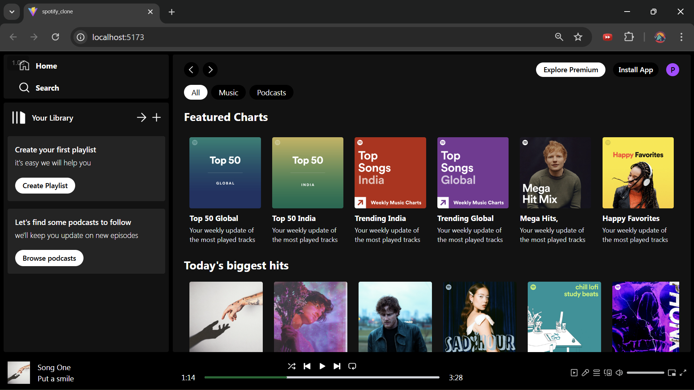
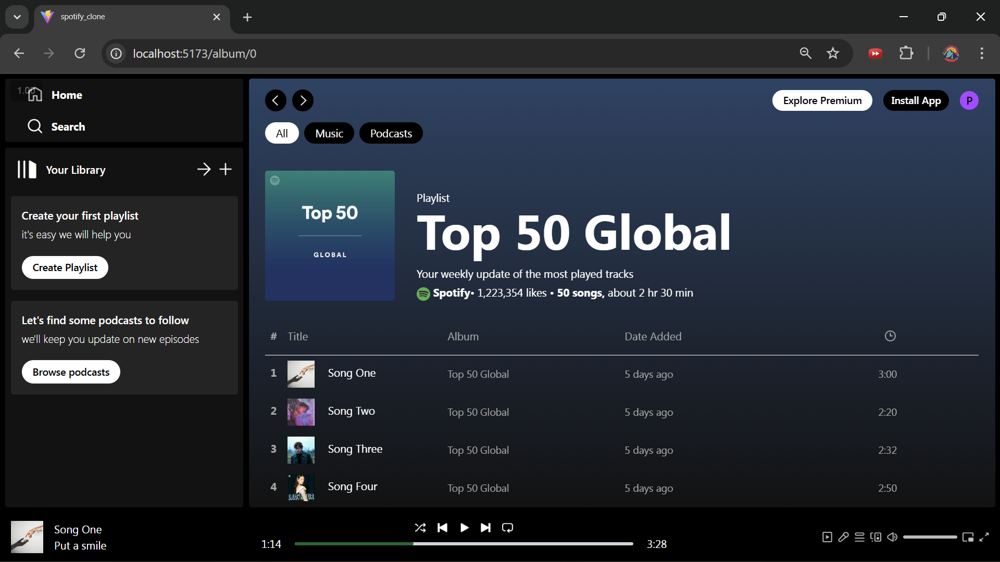

# 🎧 Spotify Clone

A modern Spotify-inspired music player UI built using **React**, **Vite**, and **Context API**.  
This project replicates core Spotify layout and playback features including sidebar navigation, album display, and an audio player.

---

## 🚀 Features

- 🎵 Play / Pause music
- ⏮️ Previous / Next track controls
- 📀 Album & playlist display
- 📱 Responsive layout
- ⚡ Fast development with Vite
- 🧠 Global state management using React Context API
- 🔊 HTML5 audio integration

---

## 🛠️ Tech Stack

- React (JSX)
- Vite
- JavaScript
- Tailwind CSS
- Context API

---

## ⚙️ Installation & Setup

### 1. Clone the repository

```bash
git clone https://github.com/your-username/spotify-clone.git
cd spotify-clone
```

### 2. Install dependencies

```bash
npm install
```

### 3. Run development server

```bash
npm run dev
```

---

## 🎮 Usage

- Click on songs/albums to play music
- Use player controls to manage playback
- Explore featured charts and playlists

---

## 🧠 How It Works

- PlayerContext manages global audio state
- Vite
- audioRef controls the HTML audio element
- Components consume context using useContext
- UI updates automatically based on current track

---

## 📸 Screenshots

- Home Screen
  

- Album Screen
  

---
